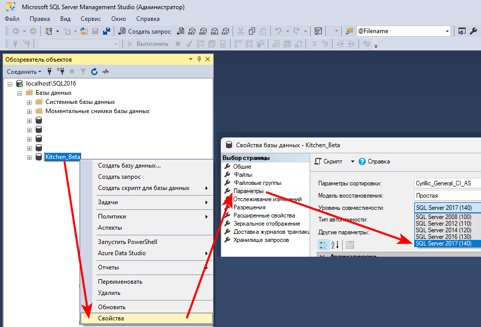

# CadExtRepo_bin
_Модуль расширения для Evolution._

### Системные требования: 
- версия SQL Server 2017 Express и выше.

### Установка: 
  1. Скопировать dll в папку `C:\Evolution\eCadPro`
  2. Зарегистрировать dll командой в терминале:
  ```sh
     "%WINDIR%\Microsoft.NET\Framework\v4.0.30319\regasm.exe" C:\Evolution\eCadPro\CadExtRepo.dll /tlb /nologo /codebase
  ```   
  4. Скопировать "AMBIENTE.VBS" в папку `С:\Evolution\eCadPro\_ecadpro\procedure`
  5. Изменить параметр в файле `С:\Evolution\eCadPro\_ecadpro\ecadpro.ini` c `bottoniaggiuntivi=` на `bottoniaggiuntivi=import;export`
  6. В `Management Studio` в "Свойства базы данных"(ПКМ на имени базы данных, это имя каталога) на странице "Параметры" изменить "Уровень совместимости".
     

### Дополнительно:
- Графическая обочка [Git Extensions](https://github.com/gitextensions/gitextensions/releases/)

  

